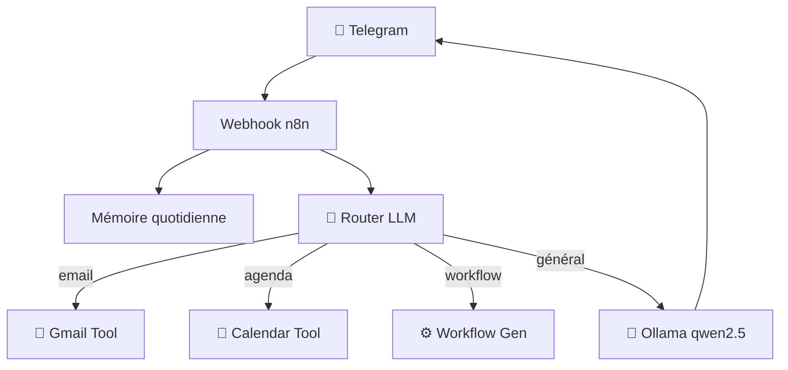

# 🤖 Agents IA — n8n + LLM

Collection d'agents IA construits avec n8n, intégrant plusieurs LLMs (Ollama local, Mistral, Anthropic, Groq). Tous pilotables via Telegram ou interface web.

## 🏗️ Architecture — Agent JP

## 🧠 Agents

### Agent JP — Assistant Personnel
Mon assistant IA quotidien sur Telegram. Architecture en routeur : analyse l'intention → dispatche vers le bon sous-agent.
- **LLM** : Ollama `qwen2.5:9b` (local, 100% privé)
- **Mémoire** : Buffer conversationnel quotidien
- **Tools** : Gmail, Google Calendar, recherche web, génération de workflows

### OpenClaw — Système Multi-Agent
Système expérimental d'agents auto-générés. L'agent principal peut créer dynamiquement de nouveaux sous-agents spécialisés.
- **Architecture** : Main Agent + SubAgents dynamiques
- **Memory** : Persistance via sous-workflow dédié
- **Tools** : `call_sub_agent`, `create_new_sub_agent`, `list_sub_agents`, `query_memory`, `save_memory`

### Mail Agent — Mistral AI + Gmail
Agent email complet piloté par Telegram.
- **Commandes** : liste emails, lecture, rédaction, réponse
- **LLM** : Mistral Large
- **Intégration** : Gmail OAuth2

### Agent Orientation Professionnelle
Chatbot de conseil de carrière — démo réutilisable pour créer un assistant métier sur mesure.
- **LLM** : Mistral AI
- **Interface** : Chatbot web responsive (servi directement par n8n)
- **Usage** : Template adaptable à tout domaine de conseil

## 🛠️ Stack

- **Orchestration** : n8n self-hosted
- **LLMs** : Ollama (local · qwen2.5), Mistral AI, Anthropic Claude, Groq (llama3)
- **Interface** : Telegram Bot + interfaces web n8n
- **Intégrations** : Gmail OAuth2, Google Calendar OAuth2
- **Mémoire** : Window buffer journalier + Google Sheets

## 📸 Captures d'écran

> *Screenshots à venir — conversation Telegram, interface web Agent Orientation*

## 🚀 Import dans n8n

1. Dans n8n → **Workflows** → **Import**
2. Importer les JSON du dossier `workflows/`
3. Configurer les credentials : Telegram, Ollama, Mistral, Groq, Gmail
4. Définir les variables : `TELEGRAM_BOT_TOKEN`, `TELEGRAM_CHAT_ID`
